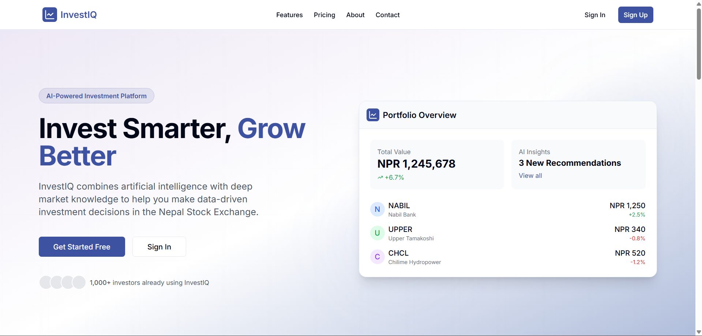

# InvestIQ

Empowering Nepali investors with AI-driven insights and tools.

---

---

## 📖 About InvestIQ

InvestIQ is on a mission to empower investors across Nepal by providing sophisticated, AI-powered tools and insights. Built specifically with the Nepali market in mind, our platform enables users—from individual retail traders to institutional investors—to make smarter, data-driven investment decisions on the Nepal Stock Exchange (NEPSE).

---

## 📚 Our Story

InvestIQ was founded by five friends with a simple mission: to make sophisticated investment tools accessible to every Nepali investor.

We recognized that while the Nepal Stock Exchange (NEPSE) offers tremendous opportunities, many investors lack the tools, data, and insights needed to make informed decisions. Our team of financial experts and AI specialists came together to build a platform that combines cutting-edge artificial intelligence with deep market knowledge.

Today, InvestIQ serves thousands of investors across Nepal, from individual retail traders to large institutional clients. We continue to innovate and improve our platform, always with our core mission in mind:  
**Invest Smarter, Grow Better.**

---

## 🎯 Vision

To become the most trusted AI-powered investment platform in Nepal—helping investors make data-driven decisions and achieve their financial goals.

---

## 💡 Core Values

- **Transparency**  
  We believe in complete transparency in how our AI models work, how we use data, and how we charge for our services.

- **Innovation**  
  We continuously push the boundaries of what's possible with AI and financial technology to deliver the best possible tools for our users.

- **Education**  
  We're committed to helping our users become more knowledgeable investors through comprehensive educational resources.

---

## 👥 Contributors

Thanks to these amazing people who have helped shape InvestIQ:

<!-- ALL-CONTRIBUTORS-LIST:START - Do not remove or modify this section -->
<table align="center">
  <tr>
    <td align="center">
      <a href="https://github.com/MohitElixir">
        
         <b>MohitElixir</b>
      </a>
    </td>
    <td align="center">
      <a href="https://github.com/SharadS28N">
        
         <b>SharadS28N</b>
      </a>
    </td>
  </tr>
</table>
<!-- ALL-CONTRIBUTORS-LIST:END -->

> 📫 For media inquiries, partnerships, or to learn more, reach out to us directly.  
> 🔗 *Invest Smarter. Grow Better. With InvestIQ.*
